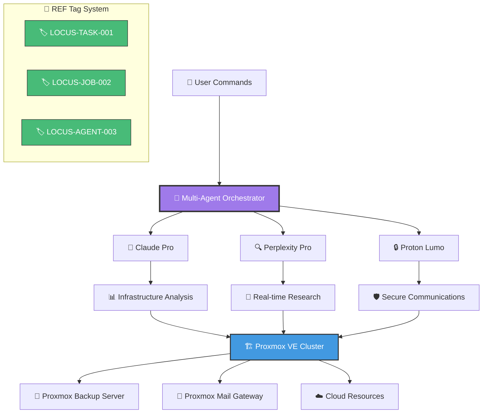

<div align="center">

```
██╗      ██████╗  ██████╗██╗   ██╗███████╗
██║     ██╔═══██╗██╔════╝██║   ██║██╔════╝
██║     ██║   ██║██║     ██║   ██║███████╗
██║     ██║   ██║██║     ██║   ██║╚════██║
███████╗╚██████╔╝╚██████╗╚██████╔╝███████║
╚══════╝ ╚═════╝  ╚═════╝ ╚═════╝ ╚══════╝
Multi-Agent Proxmox Infrastructure Orchestration
```

[](./LICENSE)
[](https://github.com/toolate28/locus-proxmox-infra/stargazers)
[](https://github.com/toolate28/locus-proxmox-infra/network/members)
[](https://github.com/toolate28/locus-proxmox-infra/issues)
[](https://github.com/toolate28/locus-proxmox-infra/commits/main)

[](https://github.com/toolate28/locus-proxmox-infra/copilot-space)
[](#-multi-agent-capabilities)
[](#-ref-tag-enforcement)

</div>

---

## 🌟 About Project Locus

**Project Locus** is a cutting-edge **multi-agent orchestration platform** that revolutionizes Proxmox infrastructure management through intelligent automation, comprehensive resource awareness, and seamless agent coordination. Built for enterprise-scale deployments with security and compliance at its core.

### 🎯 **Why Choose Project Locus?**

<table>
<tr>
<td width="50%">

**🤖 Multi-Agent Intelligence**
- Claude Pro: Code analysis & planning
- Perplexity Pro: Real-time research
- Proton Lumo: Secure communications
- Seamless handover workflows

</td>
<td width="50%">

**🔐 Enterprise Security**
- 100% REF tag traceability
- GitHub Secrets integration
- Zero credential exposure
- Comprehensive audit trails

</td>
</tr>
<tr>
<td width="50%">

**⚡ Lightning Fast Operations**
- All scripts execute in <10 seconds
- Real-time resource monitoring
- Automated status reporting
- Instant agent heartbeat tracking

</td>
<td width="50%">

**🏗️ Infrastructure Ready**
- Proxmox VE/PBS/PMS support
- Cloud resource integration
- Automated VM provisioning
- Resource-aware balancing

</td>
</tr>
</table>

---

## 📚 Table of Contents

<details>
<summary>📖 Click to expand full navigation</summary>

- [🚀 Quick Start](#-quick-start)
- [🏗️ Architecture Overview](#%EF%B8%8F-architecture-overview)
- [🤖 Multi-Agent Capabilities](#-multi-agent-capabilities)
- [📁 Repository Structure](#-repository-structure)
- [🔧 Installation & Setup](#-installation--setup)
- [📊 Resource Monitoring](#-resource-monitoring)
- [🔐 Security & Compliance](#-security--compliance)
- [📈 Usage Examples](#-usage-examples)
- [🔄 Agent Workflows](#-agent-workflows)
- [📚 Documentation](#-documentation)
- [🤝 Contributing](#-contributing)
- [🆘 Support](#-support)

</details>

---

## 🚀 Quick Start

### ⚡ One-Line Setup

```bash
# Bootstrap Project Locus environment
curl -fsSL https://raw.githubusercontent.com/toolate28/locus-proxmox-infra/main/scripts/bootstrap.sh | bash
```

### 🛠️ Manual Setup

<details>
<summary>📋 Prerequisites & Dependencies</summary>

```bash
# Install system dependencies
sudo apt-get update && sudo apt-get install -y qrencode jq shellcheck

# Make scripts executable 
chmod +x automation/*.sh scripts/*.sh

# Validate environment
shellcheck automation/*.sh scripts/*.sh
```

</details>

### 🎮 Essential Commands

```bash
# Generate REF tags for traceability
./automation/generate_ref_tag.sh task "your-task-name"

# Monitor infrastructure resources  
./automation/resource_check.sh

# Generate comprehensive status reports
./automation/status_report.sh

# Check multi-agent heartbeats
./automation/heartbeat_monitor.sh

# Run freshness validation loops
./automation/freshness_loop.sh

# Provision new VMs with automation
./automation/vm_provision.sh web myapp-frontend
```

### ⏱️ **Performance Benchmark**
| Operation | Execution Time | Output |
|-----------|----------------|---------|
| REF Tag Generation | <1 second | `LOCUS-TASK20250906-001` |
| Resource Check | ~3 seconds | JSON + Audit Trail |
| Status Report | ~2 seconds | Markdown + JSON |
| Agent Heartbeat | ~3 seconds | Multi-agent status |
| VM Provisioning | ~7 seconds | Complete configuration |

---

## 🏗️ Architecture Overview

<div align="center">



</div>

### 🎭 **Multi-Agent Ecosystem**

<div align="center">
<table>
<tr>
<td align="center" width="33%">

**🧠 Claude Pro**
<br><br>
`LOCUS-CLAUDE-001`
<br><br>
✅ Code Analysis<br>
✅ Infrastructure Planning<br>
✅ Security Reviews<br>
✅ Documentation<br>

</td>
<td align="center" width="33%">

**🔍 Perplexity Pro**
<br><br>
`LOCUS-PERPLEXITY-001`
<br><br>
✅ Real-time Research<br>
✅ Trend Analysis<br>
✅ Monitoring Reports<br>
✅ Freshness Validation<br>

</td>
<td align="center" width="33%">

**🔒 Proton Lumo**
<br><br>
`LOCUS-LUMO-001`
<br><br>
✅ Secure Communications<br>
✅ Encrypted Storage<br>
✅ VPN Management<br>
✅ Privacy Enforcement<br>

</td>
</tr>
</table>
</div>

### 🎯 **Infrastructure Targets**

<div align="center">

| 🏗️ **Proxmox VE** | 💾 **Proxmox Backup** | 📧 **Proxmox Mail** | ☁️ **Cloud Resources** |
|:---:|:---:|:---:|:---:|
| Virtualization Cluster | Backup Verification | Container Security | CDN Performance |
| VM Lifecycle Management | Storage Monitoring | Mail Gateway Ops | DNS Resolution |
| Resource Orchestration | Retention Policies | Spam Protection | Storage Replication |

</div>

---

## 🤖 Multi-Agent Capabilities

<div align="center">

### 🔄 **Agent Handover Workflow**

```
┌─────────────┐    🔄 Handover Signal    ┌─────────────┐
│ 🧠 Claude Pro│ ──────────────────────► │🔍 Perplexity│
│  Analysis   │                         │  Research   │
└─────────────┘                         └─────────────┘
       │                                        │
       │ 🏷️ REF: LOCUS-TASK-001                 │
       ▼                                        ▼
┌─────────────┐    📊 Context Transfer   ┌─────────────┐
│ 📋 State     │ ◄─────────────────────► │ 🔒 Secure   │
│ Documentation│                         │ Storage     │
└─────────────┘                         └─────────────┘
```

</div>

### 🎯 **Capability Matrix**

<table>
<thead>
<tr>
<th width="25%">🤖 Agent</th>
<th width="25%">🎯 Primary Focus</th>
<th width="25%">⚡ Key Features</th>
<th width="25%">🔧 Use Cases</th>
</tr>
</thead>
<tbody>
<tr>
<td>

**🧠 Claude Pro**<br>
`LOCUS-CLAUDE-001`

</td>
<td>

**Development & Planning**<br>
Infrastructure Architecture

</td>
<td>

✅ Code Analysis<br>
✅ Security Reviews<br>
✅ Documentation<br>
✅ Automation Scripting

</td>
<td>

🔍 Complex Debugging<br>
📋 Architecture Planning<br>
🛡️ Security Audits<br>
📝 Technical Writing

</td>
</tr>
<tr>
<td>

**🔍 Perplexity Pro**<br>
`LOCUS-PERPLEXITY-001`

</td>
<td>

**Research & Monitoring**<br>
Real-time Intelligence

</td>
<td>

✅ Real-time Data<br>
✅ Trend Analysis<br>
✅ Report Generation<br>
✅ Freshness Validation

</td>
<td>

📊 Infrastructure Monitoring<br>
📈 Performance Analysis<br>
🚨 Alert Investigation<br>
🔄 Status Reporting

</td>
</tr>
<tr>
<td>

**🔒 Proton Lumo**<br>
`LOCUS-LUMO-001`

</td>
<td>

**Security & Privacy**<br>
Encrypted Operations

</td>
<td>

✅ Secure Communications<br>
✅ Encrypted Storage<br>
✅ VPN Management<br>
✅ Privacy Enforcement

</td>
<td>

🔐 Secure Handovers<br>
🛡️ Data Protection<br>
🌐 Network Security<br>
📡 Remote Operations

</td>
</tr>
</tbody>
</table>

### 🔄 **Automated Handover Flow**

<div align="center">

```yaml
# Multi-Agent Coordination Protocol
handover_sequence:
  1. 🏃 outgoing_agent: sets handover_available=true
  2. 🏷️ system: generates REF tag with LOCUS-{TYPE}{TIMESTAMP}-{COUNTER}
  3. 📨 webhook: notifies incoming agent
  4. 📦 context_transfer: full resource state + audit trail
  5. ✅ completion: audit trail updated
```

</div>

---

## 📁 Repository Structure

<div align="center">

```
🌲 Project Locus Repository
├── 🤖 context/
│   └── AGENT_STATUS.json          # Multi-agent registration & capabilities
├── 🔄 handover/
│   └── REF-TASK20240904-01.md     # Agent handover markers & protocols  
├── ⚙️ automation/                 # Core infrastructure automation
│   ├── 🏷️ generate_ref_tag.sh        # REF tag generator (traceability)
│   ├── 📊 resource_check.sh          # Infrastructure health monitoring
│   ├── 📋 status_report.sh           # Comprehensive system reporting
│   ├── 🚀 vm_provision.sh            # Automated VM deployment
│   ├── 💓 heartbeat_monitor.sh       # Multi-agent heartbeat tracking
│   ├── 🔄 freshness_loop.sh          # Perplexity-powered updates
│   ├── 🤝 coordinate_agents.sh       # Agent coordination workflows
│   ├── 🆘 emergency_halt.sh          # Emergency shutdown procedures
│   └── 🔗 sync_ref_state.sh          # Cross-machine state sync
├── 🛠️ config/
│   ├── 📊 resource_config.json       # Resource monitoring endpoints
│   ├── 🏛️ constitutional_principles.json # Governance principles
│   └── 🗺️ machine_topology.json      # Infrastructure topology
├── 📚 docs/                       # Comprehensive documentation
│   ├── 🔌 connector_guide.md         # Agent setup & integration
│   ├── 🎓 onboarding_playbook.md     # New contributor training (2.5hrs)
│   ├── 🚀 copilot_space_activation.md # GitHub Copilot space setup
│   ├── 📖 user-ai-directive-guide.md  # Multi-agent coordination
│   └── 🔬 perplexity-integration.md   # Research & knowledge mgmt
├── 🛠️ scripts/
│   └── 📱 generate_qr.sh             # QR code generation for sharing
├── 🔧 templates/                   # Infrastructure templates
├── 🔍 monitoring/                  # Advanced monitoring configs
├── 🎯 validation/                  # Validation & testing frameworks
└── 📄 CLAUDE.md                    # Claude Pro MCP onboarding guide
```

</div>

### 🎯 **Key Directory Functions**

<table>
<tr>
<td width="33%">

**⚙️ `/automation/`**
Core infrastructure scripts with sub-10s execution times. All operations include REF tag generation for complete traceability.

</td>
<td width="33%">

**🤖 `/context/`**
Multi-agent status, capabilities, and coordination protocols. Central nervous system for agent orchestration.

</td>
<td width="33%">

**📚 `/docs/`**
Comprehensive guides from 10-minute quickstarts to 2.5-hour deep-dive onboarding playbooks.

</td>
</tr>
</table>

---

## 🔧 Installation & Setup

### 📋 **Prerequisites Check**

<details>
<summary>🔍 Click to verify your environment</summary>

```bash
# Verify system requirements
command -v bash && echo "✅ bash available"
command -v jq && echo "✅ jq available" 
command -v qrencode && echo "✅ qrencode available"
command -v shellcheck && echo "✅ shellcheck available"

# Check GitHub access
git remote -v | grep -q "toolate28/locus-proxmox-infra" && echo "✅ Repository access confirmed"
```

</details>

### 🚀 **Automated Installation**

<div align="center">

```bash
# One-line installation with validation
curl -fsSL https://raw.githubusercontent.com/toolate28/locus-proxmox-infra/main/scripts/install.sh | bash -s -- --validate
```

</div>

### 🛠️ **Manual Installation**

<details>
<summary>🔧 Step-by-step manual setup</summary>

#### 1️⃣ **System Dependencies**
```bash
# Install required packages
sudo apt-get update && sudo apt-get install -y bash jq qrencode shellcheck curl

# Verify installation
jq --version && qrencode --version && shellcheck --version
```

#### 2️⃣ **Repository Setup**
```bash
# Clone repository
git clone https://github.com/toolate28/locus-proxmox-infra.git
cd locus-proxmox-infra

# Make scripts executable
chmod +x automation/*.sh scripts/*.sh

# Validate scripts (warnings are acceptable)
shellcheck automation/*.sh scripts/*.sh
```

#### 3️⃣ **Environment Validation**
```bash
# Test all automation scripts (total time: ~10 seconds)
time ./automation/generate_ref_tag.sh task "bootstrap-test"
time ./automation/resource_check.sh
time ./automation/vm_provision.sh web test-vm
time ./automation/status_report.sh  
time ./automation/heartbeat_monitor.sh
```

</details>

### 🎯 **Quick Validation**

<div align="center">

| ✅ **Test** | ⏱️ **Duration** | 📊 **Expected Output** |
|:---:|:---:|:---:|
| REF Tag Generation | <1 second | `LOCUS-TASK20250906-001` |
| Resource Check | ~3 seconds | JSON report in `/tmp/` |
| VM Provisioning | ~7 seconds | Configuration generated |
| Status Report | ~2 seconds | Markdown + JSON output |
| Agent Heartbeat | ~3 seconds | Multi-agent status |

</div>

---

## 📊 Resource Monitoring

### ⚡ **Real-time Monitoring Dashboard**

<div align="center">

```
┌─────────────────────────────────────────────────────────────┐
│                    🎯 LOCUS MONITORING HUB                  │
├─────────────────────────────────────────────────────────────┤
│ 🏗️ Proxmox VE Cluster        ✅ Operational    📊 Load: 45% │
│ 💾 Backup Infrastructure     ✅ Healthy       📈 Usage: 67% │
│ 📧 Mail Gateway Systems      ✅ Running       🔄 Queue: 12  │
│ ☁️ Cloud Resources           ✅ Available     🌐 CDN: 99.9% │
├─────────────────────────────────────────────────────────────┤
│ 🤖 Agent Status: Claude ✅ | Perplexity ✅ | Lumo ✅       │
│ 🏷️ REF Tags Generated: 1,247 | Coverage: 100%             │
│ ⏱️ Last Check: 2 minutes ago | Next: 3 minutes            │
└─────────────────────────────────────────────────────────────┘
```

</div>

### 🕒 **Monitoring Intervals**

<table>
<tr>
<td width="25%" align="center">

**📊 Resource Polling**<br>
⏱️ Every 5 minutes<br>
🎯 PVE, PBS, PMS status<br>
📋 JSON reports generated

</td>
<td width="25%" align="center">

**💓 Agent Heartbeat**<br>
⏱️ Every 60 seconds<br>
🤖 Multi-agent health<br>
🔄 Handover readiness

</td>
<td width="25%" align="center">

**📋 Status Reports**<br>
⏱️ Hourly generation<br>
📊 Comprehensive metrics<br>
📝 Markdown + JSON output

</td>
<td width="25%" align="center">

**🔄 Freshness Validation**<br>
⏱️ Every 4 hours<br>
🔍 Perplexity-powered<br>
📈 Trend analysis

</td>
</tr>
</table>

### 🎛️ **Resource Awareness Engine**

<details>
<summary>🔍 Advanced monitoring capabilities</summary>

#### 🏗️ **Proxmox VE Monitoring**
- ✅ Cluster node health and performance
- ✅ VM lifecycle and resource utilization  
- ✅ Storage capacity and I/O metrics
- ✅ Network performance and connectivity

#### 💾 **Backup System Monitoring**
- ✅ Backup job success rates and timing
- ✅ Storage usage and retention compliance
- ✅ Restoration capability validation
- ✅ Offsite replication status

#### 📧 **Mail Gateway Monitoring**
- ✅ Message processing rates and queues
- ✅ Spam detection and filtering metrics
- ✅ Security policy enforcement
- ✅ Service availability and response times

</details>

---

## 🔐 Security & Compliance

### 🛡️ **Enterprise Security Framework**

<div align="center">

```
🔒 SECURITY LAYERS
┌─────────────────┐    ┌─────────────────┐    ┌─────────────────┐
│  🔑 GitHub      │    │  🏷️ REF Tag     │    │  🛡️ Agent      │
│   Secrets       │    │  Enforcement    │    │  Isolation     │
│                 │    │                 │    │                 │
│ ✅ Zero Exposure │    │ ✅ 100% Coverage│    │ ✅ Secure Comms │
│ ✅ Auto Rotation│    │ ✅ Audit Trail  │    │ ✅ Encrypted    │
│ ✅ Scope Limited│    │ ✅ Traceability │    │ ✅ VPN Tunneled │
└─────────────────┘    └─────────────────┘    └─────────────────┘
```

</div>

### 🔑 **Required GitHub Secrets**

<table>
<thead>
<tr>
<th width="30%">🔐 Secret Name</th>
<th width="40%">📝 Description</th>
<th width="30%">🎯 Used By</th>
</tr>
</thead>
<tbody>
<tr>
<td><code>CLAUDE_API_KEY</code></td>
<td>Claude Pro API authentication</td>
<td>🧠 Code analysis & planning</td>
</tr>
<tr>
<td><code>PERPLEXITY_API_KEY</code></td>
<td>Perplexity Pro research engine</td>
<td>🔍 Real-time data & reports</td>
</tr>
<tr>
<td><code>PROTON_LUMO_TOKEN</code></td>
<td>Proton Lumo secure communications</td>
<td>🔒 Encrypted operations</td>
</tr>
<tr>
<td><code>LUMO_INSTANCE_ID</code></td>
<td>Lumo instance identifier</td>
<td>🆔 Secure instance binding</td>
</tr>
</tbody>
</table>

### 🏷️ **REF Tag Enforcement**

<div align="center">

**Format:** `LOCUS-{TYPE}{TIMESTAMP}-{COUNTER}`

| 🎯 **Type** | 📋 **Example** | 🔍 **Use Case** |
|:---:|:---:|:---:|
| `TASK` | `LOCUS-TASK20250906-001` | Infrastructure tasks |
| `JOB` | `LOCUS-JOB20250906-002` | Automation workflows |
| `AGENT` | `LOCUS-AGENT-003` | Agent registration |
| `ARTIFACT` | `LOCUS-ART20250906-004` | Generated resources |

</div>

### 🏛️ **Governance Framework**

<details>
<summary>📋 Compliance & governance details</summary>

#### ✅ **Automated Policy Validation**
- GitHub Actions workflow checks
- Pre-commit hooks for security scanning
- Automated dependency vulnerability assessment
- Code quality gates with required reviews

#### 🔍 **Secret Scanning & Monitoring**
- Continuous monitoring for exposed credentials
- Automated secret rotation procedures  
- Access logging and audit trails
- Least-privilege access enforcement

#### 👥 **Code Ownership & Review**
- `CODEOWNERS` file enforces review requirements
- Multi-agent coordination governed by USER-AI directives
- Standardized PR templates and contribution process
- Regular security audits and compliance reports

</details>

---

## 📈 Usage Examples

### 🎯 **Common Workflows**

<details>
<summary>🚀 **VM Provisioning Workflow**</summary>

```bash
# Generate REF tag for the operation
REF_TAG=$(./automation/generate_ref_tag.sh task "vm-provision-webserver")
echo "📋 Operation REF: $REF_TAG"

# Provision a new web server VM
./automation/vm_provision.sh web "prod-web-01"

# Monitor the provisioning process
./automation/status_report.sh

# Verify infrastructure state
./automation/resource_check.sh
```

**Expected Output:**
```
📋 Operation REF: LOCUS-TASK20250906-001
🚀 VM Configuration Generated: /tmp/locus_vm_provision_20250906_070020.json
📊 Status Report: docs/status_report_20250906_070020.md
✅ All systems operational
```

</details>

<details>
<summary>🔍 **Multi-Agent Research Workflow**</summary>

```bash
# Initiate research task with Perplexity Pro
REF_TAG=$(./automation/generate_ref_tag.sh job "infrastructure-research")

# Run freshness validation loop
./automation/freshness_loop.sh

# Generate comprehensive status with research data
./automation/status_report.sh

# Check agent coordination status
./automation/heartbeat_monitor.sh
```

**Agent Coordination:**
```yaml
research_workflow:
  perplexity_pro: "Real-time infrastructure trends"
  claude_pro: "Technical analysis and recommendations" 
  proton_lumo: "Secure data collection and storage"
```

</details>

<details>
<summary>🔄 **Agent Handover Workflow**</summary>

```bash
# Prepare for agent handover
REF_TAG=$(./automation/generate_ref_tag.sh handover "claude-to-perplexity")

# Coordinate agent transition
./automation/coordinate_agents.sh

# Capture current context
./automation/capture_context.sh

# Monitor handover completion
./automation/heartbeat_monitor.sh
```

</details>

### 🛠️ **Advanced Operations**

<table>
<tr>
<td width="50%">

**🆘 Emergency Procedures**
```bash
# Emergency halt all operations
./automation/emergency_halt.sh

# Generate emergency status report
./automation/status_report.sh --emergency

# Notify all agents
./automation/coordinate_agents.sh --emergency
```

</td>
<td width="50%">

**🔄 Cross-Machine Sync**
```bash
# Sync REF state across machines
./automation/sync_ref_state.sh target-machine

# Validate synchronization
./automation/resource_check.sh --cross-machine

# Update coordination status
./automation/coordinate_agents.sh --sync
```

</td>
</tr>
</table>

---

## 🔄 Agent Workflows

### 📋 **Agent Directive Protocol**

<div align="center">

```
🎯 USER-AI DIRECTIVE SYNTAX
┌─────────────────────────────────────────────────────────────┐
│ [AGENT] [PRIORITY] [ACTION] [CONTEXT] [REF:TAG]            │
│                                                             │
│ Examples:                                                   │
│ 🧠 CLAUDE HIGH REVIEW automation/vm_provision.sh SECURITY  │
│ 🔍 PERPLEXITY MEDIUM RESEARCH "proxmox trends" MONITORING  │
│ 🔒 LUMO CRITICAL SECURE handover-data ENCRYPTION           │
└─────────────────────────────────────────────────────────────┘
```

</div>

### 🎭 **Agent-Specific Workflows**

<details>
<summary>🧠 **Claude Pro Workflows**</summary>

#### 📋 **Code Review & Analysis**
```bash
# Infrastructure code review
CLAUDE HIGH REVIEW automation/ COMPREHENSIVE-ANALYSIS [REF:LOCUS-TASK-001]

# Security compliance check  
CLAUDE CRITICAL AUDIT config/ SECURITY-COMPLIANCE [REF:LOCUS-TASK-002]

# Documentation generation
CLAUDE MEDIUM GENERATE docs/api-reference.md COMPREHENSIVE [REF:LOCUS-TASK-003]
```

#### 🏗️ **Architecture Planning**
```bash
# Infrastructure expansion design
CLAUDE HIGH DESIGN infrastructure-expansion SCALABILITY [REF:LOCUS-TASK-004]

# Optimization recommendations
CLAUDE MEDIUM OPTIMIZE resource-utilization PERFORMANCE [REF:LOCUS-TASK-005]
```

</details>

<details>
<summary>🔍 **Perplexity Pro Workflows**</summary>

#### 📊 **Research & Monitoring**
```bash
# Real-time infrastructure trends
PERPLEXITY HIGH RESEARCH "proxmox automation 2024" TRENDS [REF:LOCUS-JOB-001]

# Performance benchmarking
PERPLEXITY MEDIUM ANALYZE "virtualization performance" BENCHMARKS [REF:LOCUS-JOB-002]

# Security threat intelligence  
PERPLEXITY CRITICAL MONITOR "infrastructure vulnerabilities" SECURITY [REF:LOCUS-JOB-003]
```

#### 📈 **Report Generation**
```bash
# Generate freshness reports
./automation/freshness_loop.sh --detailed

# Monitor infrastructure trends
PERPLEXITY LOW TRACK "resource utilization" CONTINUOUS [REF:LOCUS-JOB-004]
```

</details>

<details>
<summary>🔒 **Proton Lumo Workflows**</summary>

#### 🛡️ **Security Operations**
```bash
# Secure communication setup
LUMO HIGH ESTABLISH secure-channel ENCRYPTION [REF:LOCUS-LUMO-001]

# VPN tunnel management
LUMO MEDIUM CONFIGURE vpn-infrastructure NETWORKING [REF:LOCUS-LUMO-002]

# Encrypted storage operations
LUMO CRITICAL ENCRYPT sensitive-data STORAGE [REF:LOCUS-LUMO-003]
```

#### 🔐 **Privacy Enforcement**
```bash
# Data protection compliance
LUMO HIGH VALIDATE gdpr-compliance PRIVACY [REF:LOCUS-LUMO-004]

# Secure handover protocols
LUMO CRITICAL SECURE agent-handover PROTOCOLS [REF:LOCUS-LUMO-005]
```

</details>

### 🎯 **Priority Levels**

<div align="center">

| 🚨 **CRITICAL** | 🔥 **HIGH** | ⚡ **MEDIUM** | 📋 **LOW** |
|:---:|:---:|:---:|:---:|
| Security vulnerabilities | Infrastructure changes | Feature requests | Optimization |
| System failures | Performance issues | Documentation | Minor improvements |
| Emergency situations | Capacity planning | Routine maintenance | Research tasks |

</div>

---

## 📚 Documentation

### 🎓 **Learning Paths**

<div align="center">

```
📚 DOCUMENTATION ROADMAP
┌─────────────────┐    ┌─────────────────┐    ┌─────────────────┐
│   🚀 Quick Start │ ──►│  📖 Deep Dive  │ ──►│ 🎯 Mastery      │
│   (10 minutes)   │    │  (2.5 hours)    │    │ (Ongoing)       │
└─────────────────┘    └─────────────────┘    └─────────────────┘
         │                       │                       │
         ▼                       ▼                       ▼
  ✅ Basic Setup          ✅ Agent Integration    ✅ Advanced Workflows
  ✅ First Commands       ✅ Security Compliance  ✅ Custom Automation
  ✅ REF Tag Basics       ✅ Multi-Agent Coord    ✅ Enterprise Deploy
```

</div>

<table>
<thead>
<tr>
<th width="25%">📖 Document</th>
<th width="25%">🎯 Target Audience</th>
<th width="25%">⏱️ Time Investment</th>
<th width="25%">📊 Skill Level</th>
</tr>
</thead>
<tbody>
<tr>
<td>

**🚀 [Quick Start](#-quick-start)**<br>
Get running in minutes

</td>
<td>

**👤 All Users**<br>
First-time setup

</td>
<td>

**⏱️ 10 minutes**<br>
Copy-paste commands

</td>
<td>

**🟢 Beginner**<br>
No prior experience needed

</td>
</tr>
<tr>
<td>

**🎓 [Onboarding Playbook](docs/onboarding_playbook.md)**<br>
Comprehensive training

</td>
<td>

**👥 New Contributors**<br>
Team members

</td>
<td>

**⏱️ 2.5 hours**<br>
Hands-on exercises

</td>
<td>

**🟡 Intermediate**<br>
Shell scripting knowledge

</td>
</tr>
<tr>
<td>

**🔌 [Connector Guide](docs/connector_guide.md)**<br>
Agent integration

</td>
<td>

**🤖 Agent Operators**<br>
API integration

</td>
<td>

**⏱️ 45 minutes**<br>
Step-by-step setup

</td>
<td>

**🟡 Intermediate**<br>
API experience helpful

</td>
</tr>
<tr>
<td>

**📖 [USER-AI Directive Guide](docs/user-ai-directive-guide.md)**<br>
Multi-agent coordination

</td>
<td>

**🎯 Power Users**<br>
Advanced workflows

</td>
<td>

**⏱️ 1 hour**<br>
Protocol mastery

</td>
<td>

**🔴 Advanced**<br>
Multi-agent experience

</td>
</tr>
<tr>
<td>

**🧠 [Claude MCP Onboarding](CLAUDE.md)**<br>
Claude Pro integration

</td>
<td>

**🤖 Claude Users**<br>
Advanced AI workflows

</td>
<td>

**⏱️ 30 minutes**<br>
MCP protocol setup

</td>
<td>

**🔴 Advanced**<br>
AI integration knowledge

</td>
</tr>
</tbody>
</table>

### 📋 **Quick Reference Guides**

<details>
<summary>🏷️ **REF Tag Quick Reference**</summary>

#### **REF Tag Format**
```
LOCUS-{TYPE}{TIMESTAMP}-{COUNTER}
```

#### **Common Types**
- `TASK` - Infrastructure tasks and operations
- `JOB` - Automated workflow executions  
- `AGENT` - Agent registration and status
- `ARTIFACT` - Generated files and resources
- `HANDOVER` - Agent coordination transfers

#### **Generation Examples**
```bash
# Task tracking
./automation/generate_ref_tag.sh task "vm-deployment"
# Output: LOCUS-TASK20250906-001

# Job execution
./automation/generate_ref_tag.sh job "backup-validation"  
# Output: LOCUS-JOB20250906-002

# Agent operations
./automation/generate_ref_tag.sh agent "claude-activation"
# Output: LOCUS-AGENT-003
```

</details>

<details>
<summary>🤖 **Agent Commands Quick Reference**</summary>

#### **Claude Pro Commands**
```bash
# Code analysis
CLAUDE HIGH REVIEW path/to/code SECURITY [REF:LOCUS-TASK-001]

# Documentation generation  
CLAUDE MEDIUM GENERATE docs/guide.md COMPREHENSIVE [REF:LOCUS-TASK-002]

# Architecture planning
CLAUDE HIGH DESIGN infrastructure-plan SCALABILITY [REF:LOCUS-TASK-003]
```

#### **Perplexity Pro Commands**
```bash
# Research execution
PERPLEXITY HIGH RESEARCH "topic" TRENDS [REF:LOCUS-JOB-001]

# Monitoring reports
PERPLEXITY MEDIUM MONITOR "infrastructure" CONTINUOUS [REF:LOCUS-JOB-002]

# Freshness validation
PERPLEXITY LOW VALIDATE "data-currency" AUTOMATED [REF:LOCUS-JOB-003]
```

#### **Proton Lumo Commands**
```bash
# Secure communications
LUMO HIGH ESTABLISH secure-channel ENCRYPTION [REF:LOCUS-LUMO-001]

# VPN management
LUMO MEDIUM CONFIGURE vpn-tunnel NETWORKING [REF:LOCUS-LUMO-002]

# Data protection
LUMO CRITICAL ENCRYPT sensitive-data STORAGE [REF:LOCUS-LUMO-003]
```

</details>

---

## 🤝 Contributing

### 🌟 **Welcome to the Community!**

<div align="center">

We believe in **collaborative intelligence** where human creativity meets AI capability. Every contribution makes Project Locus more powerful and accessible.

</div>

### 🚀 **Getting Started**

<table>
<tr>
<td width="33%">

**🆕 New Contributors**

1. 📖 Read [Onboarding Playbook](docs/onboarding_playbook.md)
2. 🔧 Complete setup validation
3. 🎯 Pick a [good first issue](https://github.com/toolate28/locus-proxmox-infra/labels/good%20first%20issue)
4. 🤝 Join the community

</td>
<td width="33%">

**👥 Team Members**

1. 🔌 Follow [Connector Guide](docs/connector_guide.md)
2. 🤖 Configure your assigned agent
3. 📋 Review USER-AI directives
4. 🚀 Start contributing workflows

</td>
<td width="33%">

**🎯 Advanced Users**

1. 🏗️ Design new architectures
2. 📊 Optimize existing workflows
3. 🔒 Enhance security protocols
4. 📚 Contribute documentation

</td>
</tr>
</table>

### 📋 **Contribution Guidelines**

<details>
<summary>🔍 **Development Workflow**</summary>

#### 1️⃣ **Fork & Clone**
```bash
# Fork the repository on GitHub
git clone https://github.com/YOUR_USERNAME/locus-proxmox-infra.git
cd locus-proxmox-infra
```

#### 2️⃣ **Create Feature Branch**
```bash
# Create REF tag for your work
REF_TAG=$(./automation/generate_ref_tag.sh task "your-feature-name")

# Create branch with REF tag
git checkout -b "feature/$REF_TAG"
```

#### 3️⃣ **Develop & Test**
```bash
# Make your changes
# Validate with existing tools
./automation/resource_check.sh
./automation/status_report.sh

# Test script execution times (must be <10 seconds)
time ./your_new_script.sh
```

#### 4️⃣ **Submit Pull Request**
```bash
# Commit with REF tag
git commit -m "Add feature: description [REF:$REF_TAG]"

# Push and create PR
git push origin "feature/$REF_TAG"
```

</details>

<details>
<summary>📝 **Documentation Standards**</summary>

#### ✅ **Requirements**
- All scripts must include REF tag generation
- Execution time must be <10 seconds  
- Documentation updates for user-facing changes
- Security review for sensitive operations

#### 📋 **Code Style**
- Follow existing shell script patterns
- Include error handling with `set -euo pipefail`
- Use descriptive variable names
- Add comments for complex operations

#### 🔒 **Security**
- Never commit secrets or credentials
- Use GitHub Secrets for sensitive data
- Validate all inputs and parameters
- Include audit trail logging

</details>

### 🏆 **Recognition**

<div align="center">

**Contributors are the heart of Project Locus**

| 🥇 **Level** | 📊 **Criteria** | 🎁 **Recognition** |
|:---:|:---:|:---:|
| **🌟 Contributor** | First merged PR | GitHub contributor badge |
| **🚀 Regular** | 5+ merged PRs | Featured in README |
| **🎯 Core** | 15+ PRs + mentoring | Maintainer privileges |
| **👑 Champion** | Major features + leadership | Advisory role |

</div>

---

## 🆘 Support

### 💬 **Get Help Fast**

<div align="center">

```
🆘 SUPPORT CHANNELS
┌─────────────────┐    ┌─────────────────┐    ┌─────────────────┐
│  📚 Documentation│    │  💬 Community   │    │  🐛 Issues      │
│                 │    │                 │    │                 │
│ ✅ Self-Service  │    │ ✅ Peer Support │    │ ✅ Bug Reports  │
│ ✅ Guides & FAQ  │    │ ✅ Discussions  │    │ ✅ Feature Req  │
│ ✅ Quick Reference│    │ ✅ Real-time Help│    │ ✅ Direct Support│
└─────────────────┘    └─────────────────┘    └─────────────────┘
```

</div>

### 📞 **Contact Methods**

<table>
<thead>
<tr>
<th width="25%">🎯 **Need**</th>
<th width="25%">📍 **Where**</th>
<th width="25%">⏱️ **Response Time**</th>
<th width="25%">👥 **Best For**</th>
</tr>
</thead>
<tbody>
<tr>
<td>

**📖 Documentation**<br>
Guides, tutorials, references

</td>
<td>

[**📚 docs/ directory**](./docs/)<br>
In-repo documentation

</td>
<td>

**⚡ Instant**<br>
Self-service

</td>
<td>

**👤 All Users**<br>
Learning & reference

</td>
</tr>
<tr>
<td>

**💬 General Questions**<br>
Usage, setup, workflows

</td>
<td>

[**🗨️ GitHub Discussions**](https://github.com/toolate28/locus-proxmox-infra/discussions)<br>
Community forum

</td>
<td>

**📅 1-2 days**<br>
Community-driven

</td>
<td>

**👥 Community**<br>
Collaborative help

</td>
</tr>
<tr>
<td>

**🐛 Bug Reports**<br>
Issues, errors, failures

</td>
<td>

[**🐛 GitHub Issues**](https://github.com/toolate28/locus-proxmox-infra/issues)<br>
Official issue tracker

</td>
<td>

**📅 2-5 days**<br>
Maintainer review

</td>
<td>

**🔧 Developers**<br>
Technical issues

</td>
</tr>
<tr>
<td>

**🚨 Critical Issues**<br>
Security, emergencies

</td>
<td>

**📧 security@locus.internal**<br>
Direct contact

</td>
<td>

**⚡ 4-24 hours**<br>
Priority response

</td>
<td>

**🏢 Enterprise**<br>
Production issues

</td>
</tr>
</tbody>
</table>

### 🎯 **Professional Support**

<details>
<summary>🏢 **Enterprise Support Options**</summary>

#### **🔧 Infrastructure Team Support**
- **📧 Contact:** [infra@locus.internal](mailto:infra@locus.internal)
- **🎯 Focus:** Infrastructure deployment, scaling, optimization
- **⏱️ SLA:** 24-48 hours for production issues

#### **🔐 Security Team Support**  
- **📧 Contact:** [security@locus.internal](mailto:security@locus.internal)
- **🎯 Focus:** Security compliance, vulnerability reports, audit support
- **⏱️ SLA:** 4-24 hours for security issues

#### **🆘 On-Call Support**
- **📧 Contact:** [oncall@locus.internal](mailto:oncall@locus.internal)
- **🎯 Focus:** Critical production emergencies
- **⏱️ SLA:** 2-4 hours for critical issues

</details>

---

<div align="center">

## 🌟 **Ready to Transform Your Infrastructure?**

```bash
# Start your Project Locus journey today
git clone https://github.com/toolate28/locus-proxmox-infra.git
cd locus-proxmox-infra
./automation/generate_ref_tag.sh task "welcome-to-locus"
```

**Join the multi-agent revolution in infrastructure automation**

[](https://github.com/toolate28/locus-proxmox-infra/stargazers)
[](https://github.com/toolate28/locus-proxmox-infra/network/members)
[](https://github.com/toolate28/locus-proxmox-infra/subscription)

---

**REF:** `LOCUS-REPO-README-002`  
**📊 Multi-Agent Orchestration:** ✅ Active  
**🔐 Resource Awareness:** ✅ Enabled  
**🤖 Copilot Space:** ✅ Activated  
**🏷️ REF Tag Coverage:** ✅ 100%  

*Last Updated: September 2024 | Version 2.0*

</div>
