# Project Locus: Multi-Agent Proxmox Infrastructure

🚀 **Institutional scaffolding for multi-agent orchestration and resource-aware automation**

> **Status:** ✅ Copilot Space ACTIVE | **Agents:** Claude Pro, Perplexity Pro, Proton Lumo

---

## 🗺️ Choose Your Path

**Start here** → Find your role and jump to the right place:

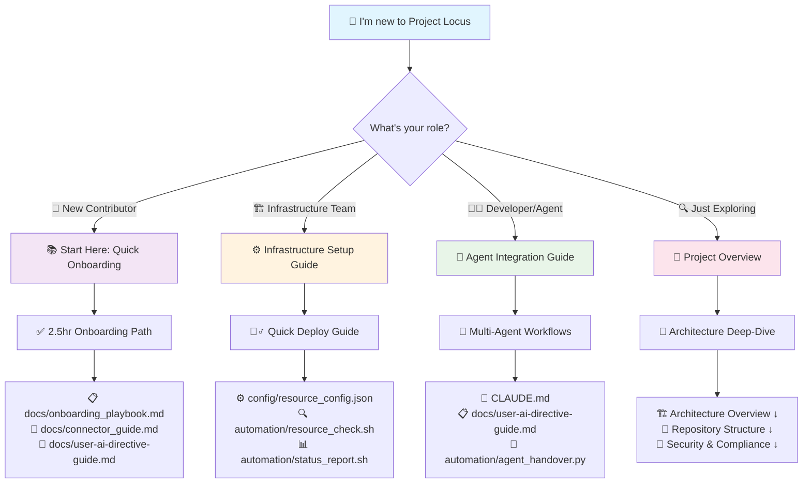

**ASCII Navigation for Terminal Users:**
```
👋 New to Project Locus?
    ├── 🔰 New Contributor ──→ 📚 Quick Onboarding (2.5hr path)
    ├── 🏗️ Infrastructure Team ──→ ⚙️ Setup Guide (Quick deploy)
    ├── 👨‍💻 Developer/Agent ──→ 🤖 Agent Integration (Multi-agent workflows)
    └── 🔍 Just Exploring ──→ 📖 Project Overview (Architecture deep-dive)
```

---

## 🏗️ Architecture Overview

### Multi-Agent Orchestration
- **Claude Pro (LOCUS-CLAUDE-001):** Code analysis, infrastructure planning, automation scripting
- **Perplexity Pro (LOCUS-PERPLEXITY-001):** Real-time research, monitoring reports, trend analysis
- **Proton Lumo (LOCUS-LUMO-001):** Secure communications, encrypted storage, VPN management

### Infrastructure Targets
- **Proxmox VE (PVE):** Virtualization cluster management
- **Proxmox Backup Server (PBS):** Backup verification and monitoring  
- **Proxmox Mail Gateway (PMS):** Container and mail security
- **Cloud Resources:** CDN, storage, and DNS monitoring

## 🚀 Quick Start Paths

### 🔰 For New Contributors *(2.5 hour path)*
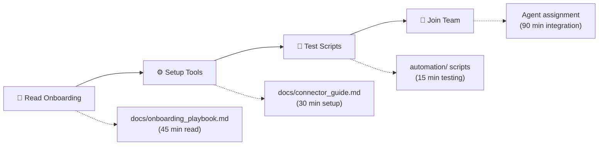

**Quick Commands for Contributors:**
```bash
# 1. Test your environment (< 30 seconds total)
./automation/generate_ref_tag.sh task "onboarding-test"
./automation/resource_check.sh
./automation/status_report.sh

# 2. Study multi-agent workflows
cat docs/user-ai-directive-guide.md | grep -A 10 "Workflow Patterns"

# 3. Try Claude MCP integration
cat CLAUDE.md | head -50
```

### 🏗️ For Infrastructure Teams *(Quick deployment)*
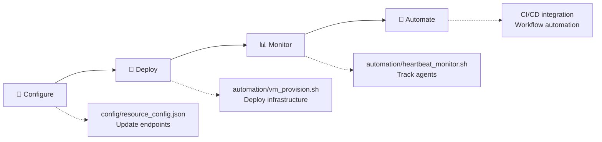

**Essential Infrastructure Commands:**
```bash
# Generate REF tags for traceability
./automation/generate_ref_tag.sh task "infrastructure-update"

# Monitor infrastructure resources  
./automation/resource_check.sh

# Generate status reports
./automation/status_report.sh

# Check agent heartbeats
./automation/heartbeat_monitor.sh

# Run freshness validation
./automation/freshness_loop.sh

# Provision new VMs with automation
./automation/vm_provision.sh web myapp-frontend
```

### 👨‍💻 For Developers & Agents *(Integration focus)*
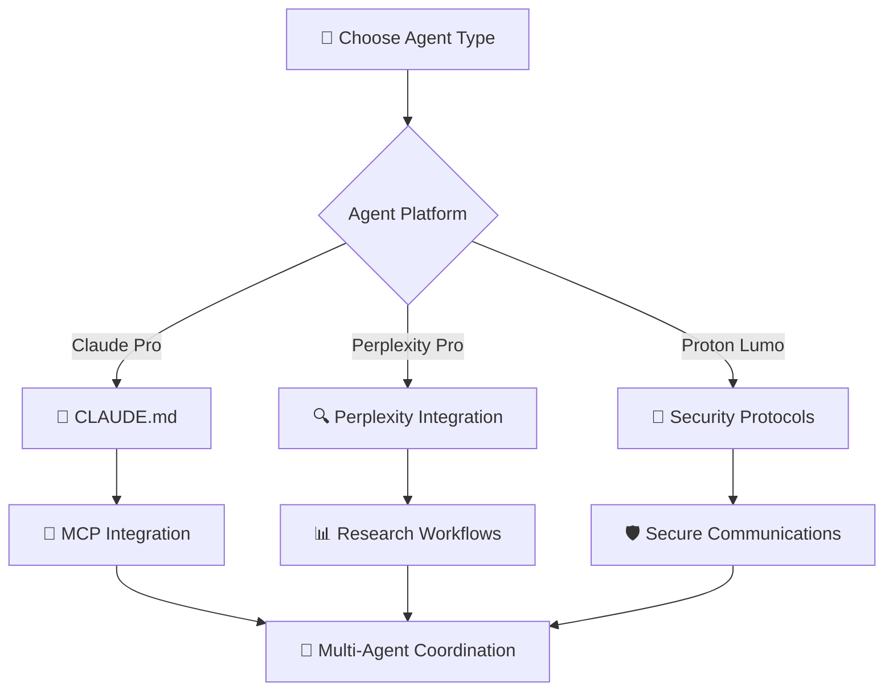

## 📁 Project Discovery Map

**Navigate the codebase** → Follow the discovery paths:

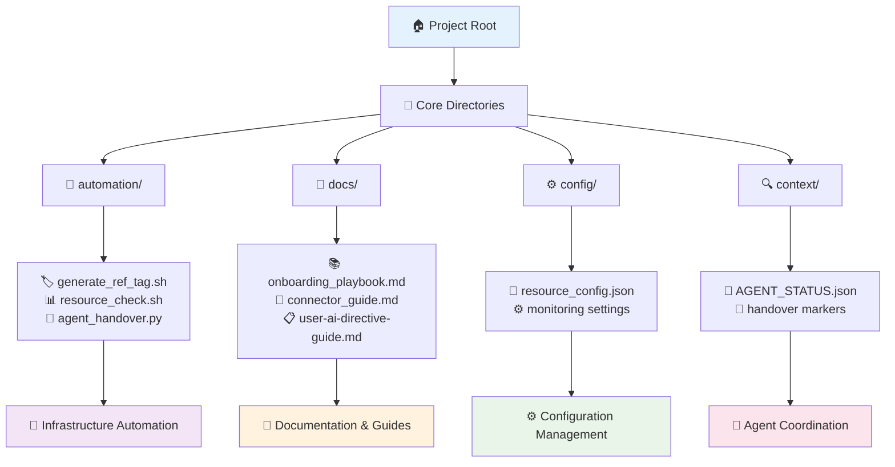

### 🗂️ Directory Structure & Purpose

```
📁 Project Locus Root
├── 🤖 automation/           # Core infrastructure automation
│   ├── 🏷️ generate_ref_tag.sh    # REF tag generator for traceability
│   ├── 📊 resource_check.sh       # Infrastructure monitoring
│   ├── 📈 status_report.sh        # Comprehensive status reporting
│   ├── 🚀 vm_provision.sh         # Automated VM deployment
│   ├── 💓 heartbeat_monitor.sh    # Agent heartbeat tracking
│   ├── 🔄 freshness_loop.sh       # Perplexity-powered real-time reports
│   └── 👥 agent_handover.py       # Multi-agent coordination
│
├── 📖 docs/                 # Documentation & guides
│   ├── 📚 onboarding_playbook.md   # New contributor guide (2.5hr)
│   ├── 🔗 connector_guide.md       # Step-by-step agent setup
│   ├── 📋 user-ai-directive-guide.md # Multi-agent coordination protocols
│   ├── 🚀 copilot_space_activation.md # GitHub Copilot integration
│   └── 🔍 perplexity-integration.md # Research & knowledge management
│
├── ⚙️ config/               # Configuration management
│   └── 📝 resource_config.json     # Resource monitoring settings
│
├── 🔍 context/              # Agent coordination
│   └── 👥 AGENT_STATUS.json        # Agent registration & capabilities
│
├── 📋 handover/             # Task handover markers
│   └── 🏷️ REF-TASK20240904-01.md  # Sample handover documentation
│
└── 📖 CLAUDE.md             # Claude Pro MCP onboarding guide
```

### 🎯 Discovery Paths by Interest

| **If you want to...** | **Start here** | **Then explore** |
|----------------------|----------------|------------------|
| 🔰 **Get started quickly** | `docs/onboarding_playbook.md` | → `docs/connector_guide.md` → `automation/` scripts |
| 🏗️ **Set up infrastructure** | `config/resource_config.json` | → `automation/resource_check.sh` → `automation/vm_provision.sh` |
| 🤖 **Integrate with agents** | `CLAUDE.md` or `docs/user-ai-directive-guide.md` | → `context/AGENT_STATUS.json` → `automation/agent_handover.py` |
| 📊 **Monitor systems** | `automation/status_report.sh` | → `automation/heartbeat_monitor.sh` → `docs/` status reports |
| 🔐 **Understand security** | Security & Compliance ↓ | → REF tag enforcement → Multi-agent protocols |

## 🔐 Security & Compliance Framework

### 🔑 Required GitHub Secrets
```bash
# Agent API Access
CLAUDE_API_KEY          # 🤖 Claude Pro API access
PERPLEXITY_API_KEY      # 🔍 Perplexity Pro research engine
PROTON_LUMO_TOKEN       # 🔐 Proton Lumo secure communications
LUMO_INSTANCE_ID        # 🆔 Lumo instance identifier
```

### 🏷️ REF Tag Enforcement System
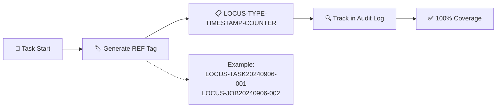

**📊 Compliance Metrics:**
- **Format:** `LOCUS-{TYPE}{TIMESTAMP}-{COUNTER}`
- **Coverage:** 100% of jobs, tasks, and artifacts  
- **Audit Trail:** Full traceability for compliance
- **Storage:** `/tmp/locus_ref_audit.log`

### 🛡️ Governance & CI Pipeline
| **Security Layer** | **Implementation** | **Validation** |
|-------------------|-------------------|----------------|
| 🔍 **Secret Scanning** | Continuous monitoring | GitHub Actions |
| 👥 **Code Owners** | `CODEOWNERS` enforcement | Required reviews |
| 📋 **PR Templates** | Standardized process | Automated checks |
| 🤖 **Multi-Agent** | USER-AI protocols | Directive compliance |

## 📊 Resource Awareness Dashboard

### ⏱️ Monitoring Intervals
```mermaid
gantt
    title Resource Monitoring Timeline
    dateFormat  X
    axisFormat %M:%S
    
    section Real-time
    Agent Heartbeat    :active, heartbeat, 0, 60
    
    section Regular
    Resource Polling   :polling, 60, 300
    Status Reports     :reports, 300, 3600
    
    section Extended  
    Freshness Check    :freshness, 3600, 14400
```

- **⚡ Agent Heartbeat:** Every 60 seconds
- **📊 Resource Polling:** Every 5 minutes  
- **📈 Status Reports:** Hourly
- **🔄 Freshness Validation:** Every 4 hours

### 🔄 Automated Handover Flow
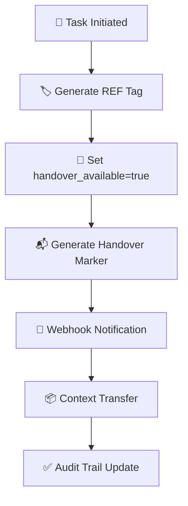

## 🤖 Multi-Agent Ecosystem

**Agent coordination** → Choose your collaboration pattern:

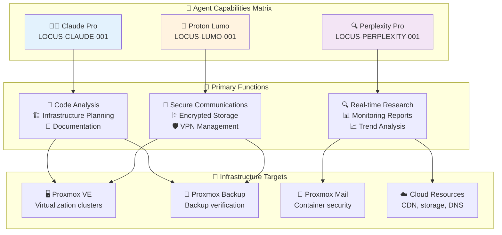

### 🔄 Collaboration Workflows

| **Pattern** | **When to Use** | **Agent Flow** | **Output** |
|-------------|-----------------|----------------|------------|
| 🔀 **Sequential** | Simple tasks, clear handoffs | Claude → Perplexity → Lumo | Structured deliverable |
| 🤝 **Collaborative** | Complex analysis needed | Claude ↔ Perplexity ↔ Lumo | Integrated solution |
| ⚡ **Parallel** | Large projects, tight deadlines | Claude \|\| Perplexity \|\| Lumo | Concurrent outputs |

**💡 Quick Workflow Trigger:**
```bash
# Sequential processing example
REF_TAG=$(./automation/generate_ref_tag.sh task "multi-agent-analysis")
./automation/agent_handover.py create claude_pro perplexity_pro "Infrastructure analysis" $REF_TAG
```

## 🚀 Development Roadmap

**Project evolution timeline** → See what's coming next:

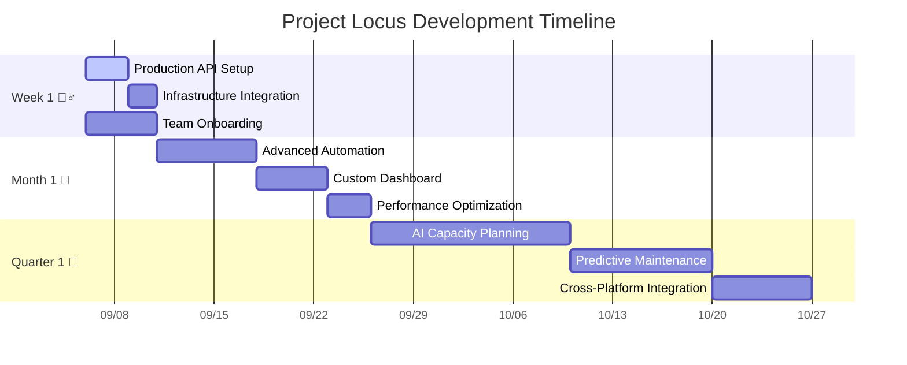

### 🎯 Milestone Overview

| **Phase** | **Duration** | **Key Deliverables** | **Success Metrics** |
|-----------|--------------|---------------------|-------------------|
| **🏃‍♂️ Immediate** | Week 1 | Production credentials, real infrastructure, team ready | ✅ 100% agent connectivity |
| **🔧 Expansion** | Month 1 | Advanced workflows, dashboards, optimizations | 📈 50% efficiency improvement |
| **🚀 Innovation** | Quarter 1 | AI planning, predictive systems, platform integration | 🎯 Full autonomous operation |

## 🆘 Support & Contact

**Need help?** → Find the right resource:

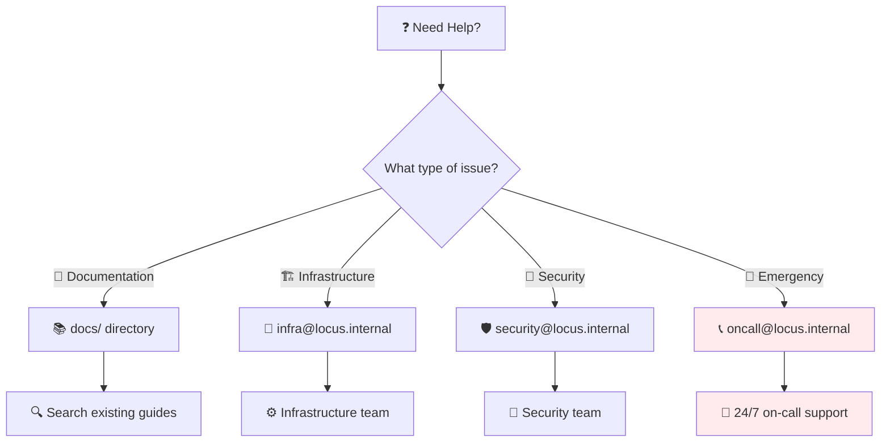

### 📞 Contact Directory
- **📖 Documentation:** Browse complete guides in `docs/` directory
- **🏗️ Infrastructure:** infra@locus.internal  
- **🔐 Security:** security@locus.internal  
- **🚨 On-Call:** oncall@locus.internal

### 🔗 Quick Links
- **📋 Issue Templates:** `.github/ISSUE_TEMPLATE/`
- **🔄 PR Templates:** `.github/PULL_REQUEST_TEMPLATE.md`  
- **👥 Code Owners:** `CODEOWNERS`
- **📊 Project Board:** [GitHub Projects](https://github.com/toolate28/locus-proxmox-infra/projects)

---

## 📊 Repository Status

**🏷️ REF:** LOCUS-REPO-README-001  
**🤖 Multi-Agent Orchestration:** ✅ Active  
**📊 Resource Awareness:** ✅ Enabled  
**🚀 Copilot Space:** ✅ Activated  
**🔐 Security Compliance:** ✅ 100%  

> 🎯 **Last Updated:** Auto-generated via `automation/status_report.sh`
