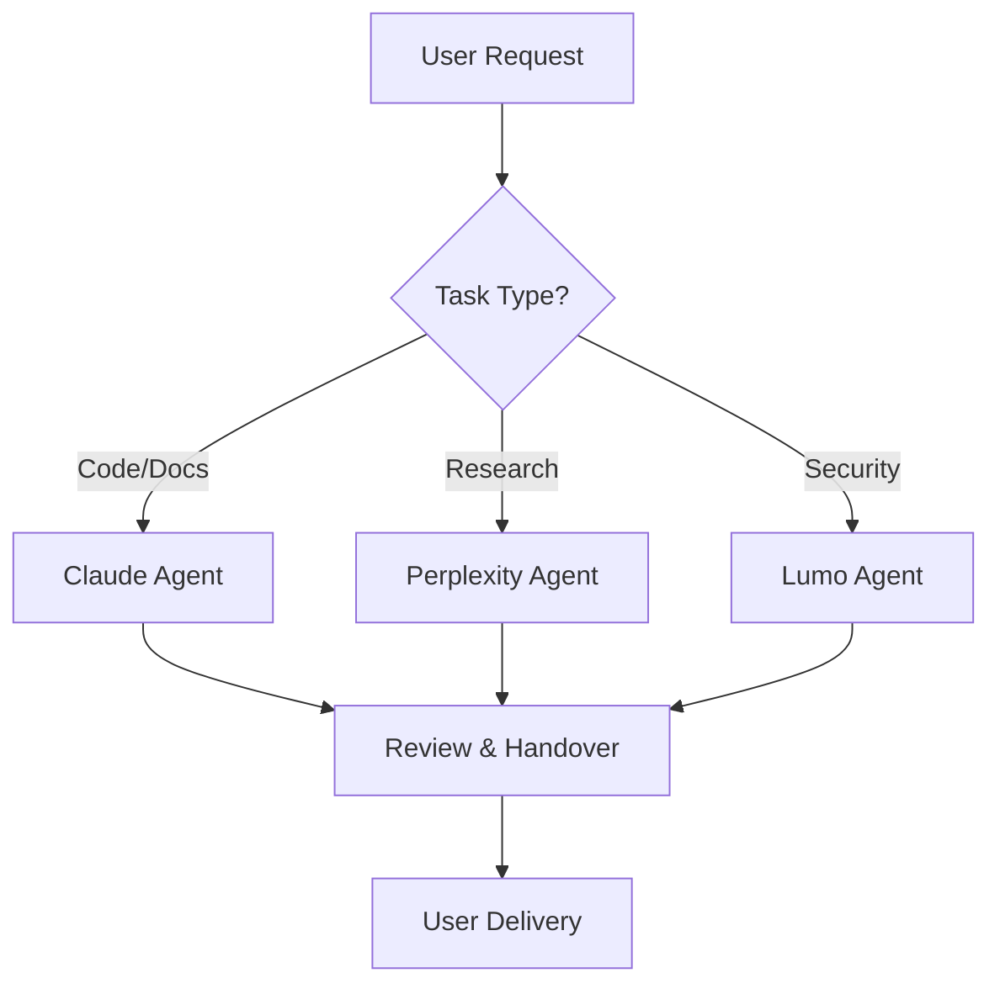
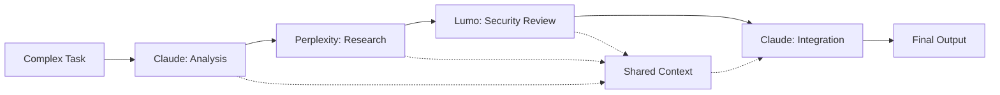
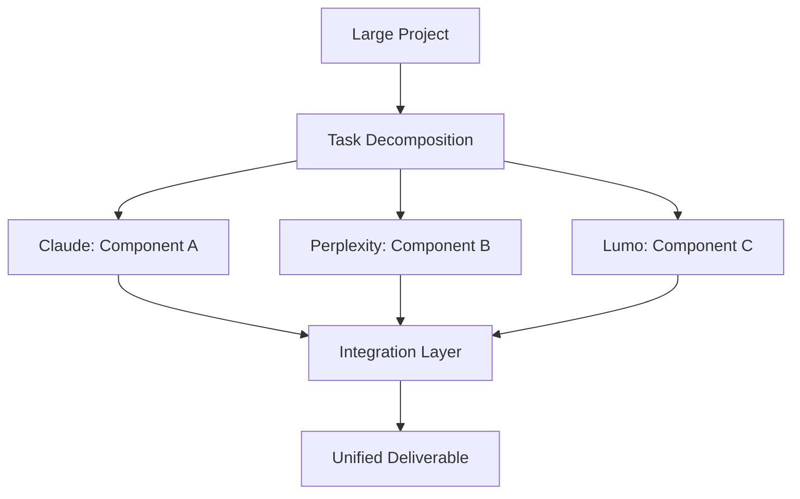
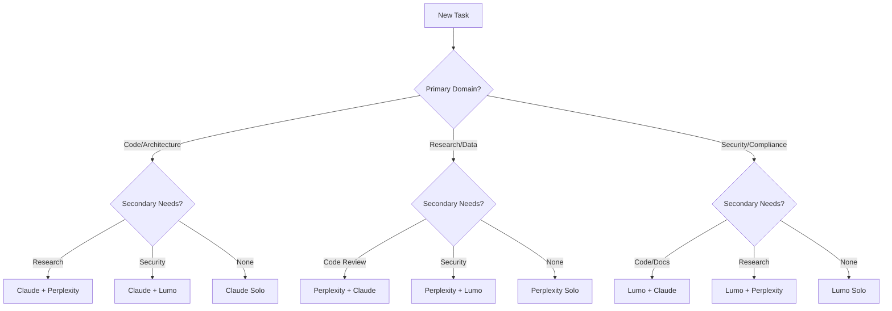

# USER-AI Directive Guide
## Project Locus Multi-Agent Orchestration

### Overview
This guide establishes standardized directives for human-AI collaboration within Project Locus infrastructure management. It provides clear protocols for agent interactions, task delegation, and resource coordination.

---

## 🤖 Agent Interaction Patterns

### Primary Agent Roles

#### Claude Pro Agent
- **Primary Role:** Code analysis, documentation generation, infrastructure planning
- **Strengths:** Complex reasoning, technical writing, architecture design
- **Best For:** Development tasks, documentation updates, system planning

#### Perplexity Pro Agent  
- **Primary Role:** Research, real-time data analysis, monitoring reports
- **Strengths:** Current information access, trend analysis, comparative research
- **Best For:** Infrastructure monitoring, technology recommendations, status reports

#### Proton Lumo Agent
- **Primary Role:** Secure communications, encrypted storage, VPN management
- **Strengths:** Security protocols, encrypted data handling, secure tunneling
- **Best For:** Security audits, secure file transfers, compliance verification

---

## 📋 Directive Framework

### Standard Directive Format
```
[AGENT-TYPE] [PRIORITY] [ACTION] [CONTEXT] [EXPECTED-OUTCOME]
```

#### Examples:
```bash
# Code review directive
CLAUDE HIGH REVIEW context/agent_config.json SECURITY-COMPLIANCE

# Infrastructure monitoring directive  
PERPLEXITY MEDIUM MONITOR proxmox-cluster STATUS-REPORT

# Security audit directive
LUMO HIGH AUDIT automation/scripts VULNERABILITY-SCAN
```

---

## 🔄 Multi-Agent Workflow Patterns

### Pattern 1: Sequential Processing



**ASCII Fallback:**
```
User Request
     |
Task Type Decision
     |
├── Code/Docs → Claude Agent ──┐
├── Research → Perplexity Agent ─┤
└── Security → Lumo Agent ───────┘
     |
Review & Handover
     |
User Delivery
```

### Pattern 2: Collaborative Processing



**ASCII Fallback:**
```
Complex Task → Claude Analysis → Perplexity Research → Lumo Security → Claude Integration → Final Output
                     ↓              ↓                    ↓              ↑
                     └──────── Shared Context ─────────────────────────┘
```

### Pattern 3: Parallel Processing



**ASCII Fallback:**
```
Large Project
     |
Task Decomposition
     |
├── Claude: Component A ──┐
├── Perplexity: Component B ─┤
└── Lumo: Component C ────┘
     |
Integration Layer
     |
Unified Deliverable
```

---

## 🎯 Task Delegation Framework

### Priority Levels
- **CRITICAL:** Security vulnerabilities, system failures
- **HIGH:** Infrastructure changes, performance issues  
- **MEDIUM:** Feature requests, documentation updates
- **LOW:** Optimization, minor improvements

### Context Sharing Protocol
1. **REF Tag Generation:** All tasks must include unique REF tags
2. **State Documentation:** Current system state must be captured
3. **Handover Markers:** Clear transition points between agents
4. **Audit Trail:** All actions logged for compliance

---

## 🔧 Implementation Directives

### For Infrastructure Tasks
```bash
# Generate REF tag first
REF_TAG=$(./automation/scripts/generate_ref_tag.sh task "infrastructure-update")

# Document current state
./automation/scripts/status_report.sh > /tmp/pre-change-state.md

# Execute with appropriate agent
[AGENT] [PRIORITY] [ACTION] [CONTEXT] [REF:$REF_TAG]

# Document post-change state
./automation/scripts/status_report.sh > /tmp/post-change-state.md
```

### For Documentation Tasks
```bash
# Generate documentation REF
REF_TAG=$(./automation/scripts/generate_ref_tag.sh doc "user-guide-update")

# Claude agent directive for documentation
CLAUDE MEDIUM UPDATE docs/user-guide.md COMPREHENSIVE-REVIEW [REF:$REF_TAG]

# Perplexity agent for research support
PERPLEXITY LOW RESEARCH "current best practices" CONTEXT-ENHANCEMENT [REF:$REF_TAG]
```

### For Security Tasks
```bash
# Security audit REF
REF_TAG=$(./automation/scripts/generate_ref_tag.sh security "weekly-audit")

# Lumo agent directive
LUMO HIGH AUDIT automation/scripts VULNERABILITY-SCAN [REF:$REF_TAG]

# Follow-up with Claude for remediation
CLAUDE HIGH REMEDIATE security-findings IMPLEMENTATION-PLAN [REF:$REF_TAG]
```

---

## 📊 Agent Coordination Matrix

### Decision Tree for Agent Selection



**ASCII Fallback:**
```
New Task
    |
Primary Domain?
    |
├── Code/Architecture
│   ├── + Research → Claude + Perplexity
│   ├── + Security → Claude + Lumo  
│   └── None → Claude Solo
│
├── Research/Data
│   ├── + Code Review → Perplexity + Claude
│   ├── + Security → Perplexity + Lumo
│   └── None → Perplexity Solo
│
└── Security/Compliance
    ├── + Code/Docs → Lumo + Claude
    ├── + Research → Lumo + Perplexity
    └── None → Lumo Solo
```

---

## 🚀 Quick Reference Commands

### Agent Invocation
```bash
# Single agent task using existing scripts
./automation/scripts/invoke_agent.sh [AGENT] [PRIORITY] [TASK] [CONTEXT]

# Multi-agent coordination
./automation/scripts/coordinate_agents.sh [LEAD_AGENT] [SUPPORT_AGENTS] [TASK] [CONTEXT]

# Emergency halt for critical situations
./automation/scripts/emergency_halt.sh --halt [REASON] [SEVERITY]
```

### Context Management
```bash
# Capture current context
./automation/scripts/capture_context.sh [REF_TAG]

# Sync reference state between systems
./automation/scripts/sync_ref_state.sh --sync [TARGET]

# Generate REF tags for traceability
./automation/scripts/generate_ref_tag.sh [TYPE] [DESCRIPTION]
```

### Monitoring & Reporting
```bash
# Agent heartbeat status check
./automation/scripts/heartbeat_monitor.sh

# Infrastructure resource check
./automation/scripts/resource_check.sh

# Generate comprehensive status report
./automation/scripts/status_report.sh
```

---

## 📚 Best Practices

### DO's
- ✅ Always generate REF tags for traceability
- ✅ Document context before agent handovers
- ✅ Use appropriate priority levels
- ✅ Validate agent capabilities match task requirements
- ✅ Maintain audit trails for compliance
- ✅ Share relevant context between coordinating agents

### DON'Ts
- ❌ Skip REF tag generation for any significant task
- ❌ Use CRITICAL priority for non-urgent items
- ❌ Delegate security tasks to non-Lumo agents without review
- ❌ Assume agents have persistent memory between sessions
- ❌ Ignore agent-specific strengths and limitations
- ❌ Mix sensitive and non-sensitive data in shared contexts

---

## 🔍 Troubleshooting

### Common Issues
1. **Agent Not Responding**
   - Check agent heartbeats with `./automation/scripts/heartbeat_monitor.sh`
   - Verify API credentials in GitHub Secrets
   - Review status reports for errors

2. **Context Sharing Failures**
   - Ensure REF tags are properly formatted
   - Check file permissions on shared context files
   - Validate context size limits

3. **Task Coordination Problems**
   - Review agent capability matrix
   - Check for conflicting task priorities
   - Verify handover marker generation

### Emergency Procedures
- **System-wide Agent Failure:** Execute `./automation/scripts/emergency_halt.sh --halt "system-failure" critical`
- **Security Incident:** Immediately invoke Lumo agent with CRITICAL priority
- **Data Loss Risk:** Trigger backup verification with all agents

---

**Document REF:** LOCUS-DOC-USER-AI-GUIDE  
**Version:** 1.0  
**Last Updated:** 2024-09-04T22:15:00Z  
**Next Review:** 2024-10-04T22:15:00Z